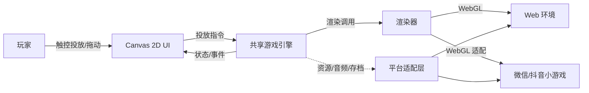
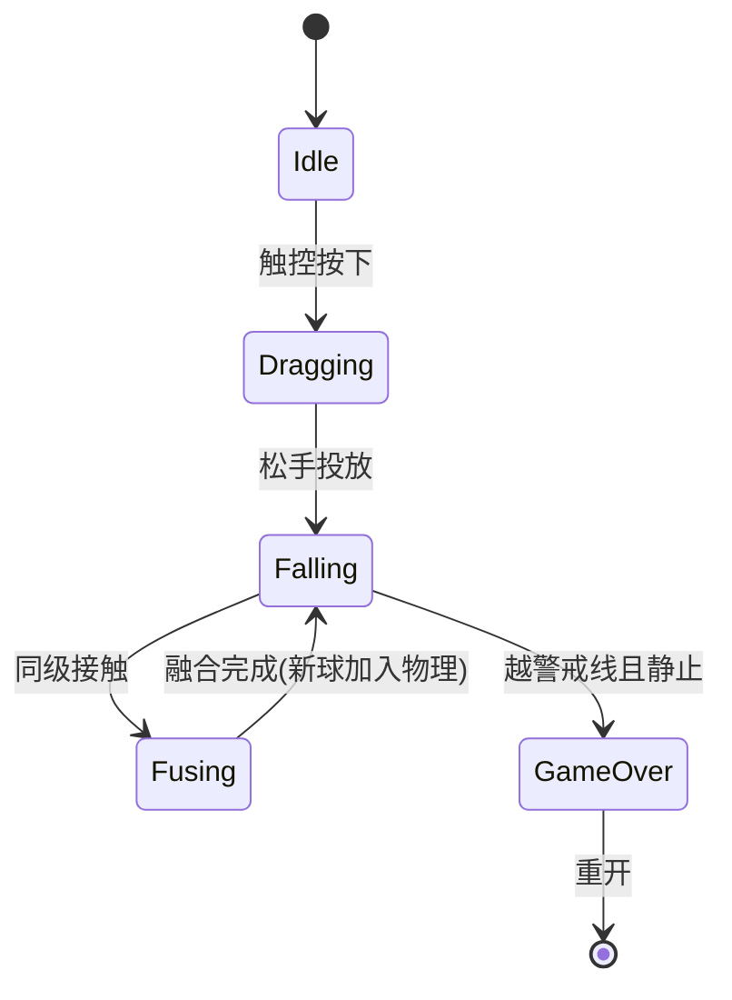
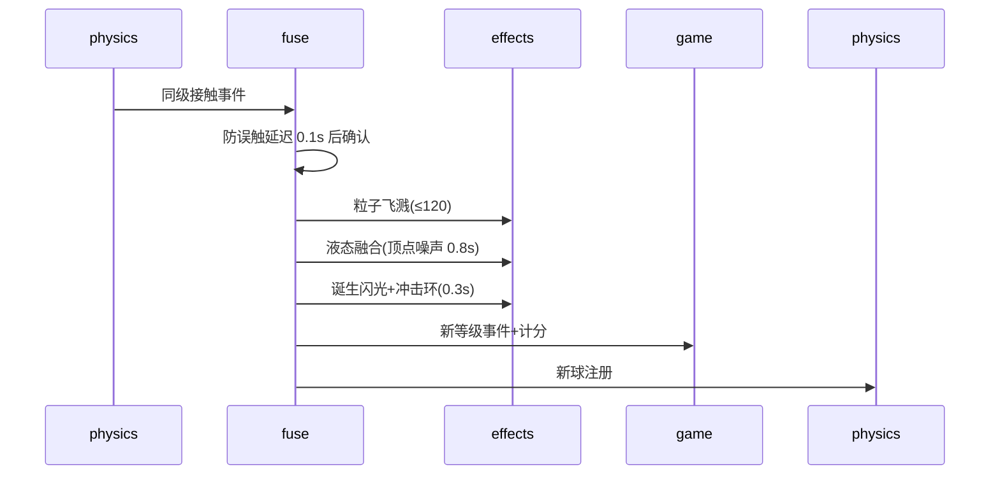

# 黏土怪物合成进化游戏 · 详细设计

> 适用：Web 浏览器 / 微信小游戏 / 抖音小游戏 三端，2026-08-21，v1.0（设计稿）

## 1. 概述

### 1.1 背景与目标

制作一款「大西瓜式」合成进化游戏：玩家投掷程序化生成的黏土怪物，同级怪物相撞触发黏土融合动态特效并进化为更高等级，10 级封顶计分，容器溢出即失败。核心卖点是**黏土风格的融合动态特效**与**每次随机生成的独特怪物外观**。

### 1.2 目标平台

| 端 | 环境 | 说明 |
|---|---|---|
| Web | 现代移动浏览器（iOS Safari / Android Chrome） | 开发验证主端，Vite 构建静态包 |
| 微信小游戏 | `wx.*` API，Canvas/WebGL 环境，无 DOM | 单 JS 文件 + 适配层 |
| 抖音小游戏 | `tt.*` API，Canvas/WebGL 环境，无 DOM | API 与微信相似，共享适配实现 |

### 1.3 范围

- **包含**：投掷合成玩法、程序化怪物生成、融合特效、Canvas 2D UI（HUD/图鉴/弹窗）、三端适配、存档
- **不包含**：联网对战、付费、好友排行、音频素材制作（用程序化音效或暂缺）

### 1.4 术语

| 术语 | 含义 |
|---|---|
| 融合序列 | 同级相撞后约 1.5s 的融合动画过程 |
| 警戒线 | 容器顶部水平线，怪物越线判负 |
| 平台适配层 | 屏蔽 wx/tt/web 差异的接口层 |

## 2. 系统上下文



引擎是唯一的游戏状态持有者；UI 只读状态并发出投放指令；渲染器与平台能力均经抽象接口访问。三端共享同一份引擎与 UI 代码，仅入口与适配层分端。

## 3. 总体设计

### 3.1 架构

```mermaid
flowchart TB
    subgraph 共享核心 src/
        subgraph engine/
            M[monster.ts 程序化生成]
            S[scene.ts 场景/相机/灯光]
            PH[physics.ts cannon-es 刚体]
            FU[fuse.ts 融合检测]
            EF[effects.ts 特效系统]
            G[game.ts 状态机/计分]
        end
        subgraph ui/
            H[hud.ts HUD]
            B[bestiary.ts 图鉴]
            O[overlay.ts 弹窗/按钮]
        end
        subgraph platform/
            T[types.ts Platform 接口]
            WE[web.ts] / WX[wechat.ts] / DY[douyin.ts]
        end
    end
    ENTRY[main.ts 按平台选实现] --> M
    ENTRY --> UI
    ENTRY --> PLAT[platform]
    G -->|渲染| S
    FU --> EF
    UI --> G
```

### 3.2 模块职责

| 模块 | 职责 | 依赖 |
|---|---|---|
| `monster.ts` | 种子化生成怪物外观参数与网格；等级→体型/特征映射 | three |
| `scene.ts` | 场景、相机、灯光、渲染循环、容器与地面 | three |
| `physics.ts` | 刚体创建/同步、重力、2D 圆碰撞 | cannon-es |
| `fuse.ts` | 同级接触检测、防误触延迟、融合流程编排 | engine 内部 |
| `effects.ts` | 粒子/顶点变形/冲击环特效原语，预算控制与回收 | three |
| `game.ts` | 状态机、计分、投放规则、胜负判定、存档读写 | engine 内部 |
| `ui/*` | Canvas 2D 绘制 HUD/图鉴/弹窗，触控命中检测 | platform |
| `platform/*` | 输入/屏幕/音频/资源/存档/安全区抽象 | 无 |

### 3.3 技术选型与决策

| 决策 | 选择 | 理由 |
|---|---|---|
| 渲染 | Three.js（WebGLRenderer） | 真 3D 黏土质感；微信官方 `threejs-miniprogram` 适配 |
| 物理 | cannon-es | 纯 JS 无 DOM 依赖；圆形碰撞适配大西瓜玩法 |
| UI | Canvas 2D 自绘 | 小游戏无 DOM；一套 UI 三端复用，风格一致 |
| 前端框架 | 无（纯 TS） | UI 自绘后 Vue/React 无必要，避免分叉 |
| 构建 | Vite（Web）/ Vite lib 模式（小游戏单 JS） | 单套工具链 |
| 测试 | Vitest（引擎纯逻辑） | 渲染与特效人工验证 |

### 3.4 跨端铁律

引擎与 UI 代码**禁止**直接访问 `window / document / navigator / localStorage`；一切平台能力经 `platform` 接口。渲染上下文由平台提供（Web 为 canvas 元素，小游戏为适配后的 WebGL 上下文）。

## 4. 接口设计

### 4.1 Platform 接口（`platform/types.ts`）

```ts
interface Platform {
  createCanvas(): CanvasLike                 // 渲染画布
  size(): { width: number; height: number; dpr: number }
  safeArea(): { top: number; bottom: number } // 刘海屏留白
  input(): Input                             // 指针/多点触控流
  loadAsset(url: string): Promise<ArrayBuffer>
  playAudio(data: ArrayBuffer): Promise<void> // 程序化音效可缺省
  storage: {
    get<T>(key: string): T | null
    set(key: string, value: unknown): void
  }
}
```

三端实现：`web.ts`（pointer events + fetch + HTMLAudio）、`wechat.ts`（wx API）、`douyin.ts`（tt API，复用 wechat 实现的可共用部分）。

### 4.2 引擎事件（UI 消费）

```ts
type GameEvent =
  | { type: 'score'; score: number }
  | { type: 'next'; level: number }          // 下一只预览
  | { type: 'fuse'; level: number }          // 融合完成（新等级）
  | { type: 'bestiary'; collected: number[] } // 图鉴进度
  | { type: 'over'; win: boolean; score: number }
```

### 4.3 UI 指令（引擎消费）

```ts
type GameCommand =
  | { type: 'drop'; x: number }              // 在 x 处投放当前球
  | { type: 'restart' }
```

### 4.4 存档 schema（`platform.storage`）

```ts
{ bestScore: number; bestiary: number[] }   // bestiary 为已合成的等级列表
```

## 5. 详细设计

### 5.1 玩法状态机（`game.ts`）



### 5.2 融合流程（`fuse.ts` + `effects.ts`）



融合期间两球对物理世界透明（不受力、不阻挡），完成后新球才注册。特效总时长 ≤ 1.5s，结束后对象回收到对象池。

### 5.3 怪物生成（`monster.ts`）

- 种子 → 外观参数集（体型/眼睛/嘴/角/触须/黏土色系颜色）
- 几何：球体顶点噪声扰动 + 特征附加（眼窝凹陷+眼珠、切口嘴、锥形角）
- 材质：`MeshStandardMaterial` 粗糙度 0.6~0.8 + 凹凸噪声
- 等级梯度：1 级呆萌圆球（双眼）→ 10 级多眼/长角/触须巨兽；碰撞半径随等级固定，保证物理公平

### 5.4 计分与胜负

| 规则 | 值 |
|---|---|
| 投放等级 | 随机 1~3 级 |
| 融合得分 | 新等级 × 10 |
| 容器 | 竖屏 3:4（移动端全屏适配，Web 端居中缩放） |
| 失败 | 任一球越过容器顶部警戒线且停止运动 |
| 胜利 | 合成出 10 级 |
| 存档 | 最高分 + 图鉴进度 |

## 6. 非功能设计

| 维度 | 约束 |
|---|---|
| 性能 | 单特效粒子 ≤ 200；特效 ≤ 1.5s 后回收；关闭阴影；帧率 < 30fps 持续 2s 自动降级（粒子减半、关顶点动画） |
| 兼容性 | iOS Safari 13+ / Android Chrome 60+；微信基础库 2.30+；抖音小游戏基础库同微信策略 |
| 安全区 | 刘海屏顶部/底部留白经 `platform.safeArea` |
| 异常防护 | 球穿出容器边界自动清除；投放中切后台挂起投放 |

## 7. 测试策略与验证清单

- **单元测试（Vitest）**：融合检测与防误触、计分、怪物参数种子确定性（同种子同结果）、状态机流转
- **人工验证**：Web 浏览器跑核心流程（投放→融合→计分→结束→重开）；微信开发者工具与抖音开发者工具各跑一轮冒烟
- **三端收尾清单**：Web 真机浏览器 / 微信开发者工具 / 抖音开发者工具各验证：投放、融合特效、胜负判定、图鉴、存档

## 8. 风险与对策

| 风险 | 对策 |
|---|---|
| 小游戏 WebGL 上下文与 Three.js 兼容性 | 采用官方 `threejs-miniprogram` 适配路径，Web 端先行验证 |
| 移动端低端机粒子性能 | 特效预算硬约束 + 帧率自动降级 |
| cannon-es 在小游戏环境受限（无 eval/new Function） | 选型时已验证纯 JS；构建后冒烟确认 |
| 融合误触发 | 0.1s 防误触延迟 + 融合期物理透明 |
